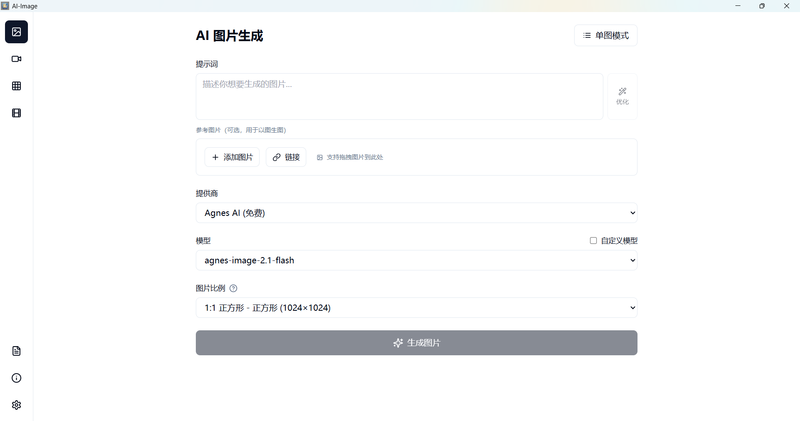
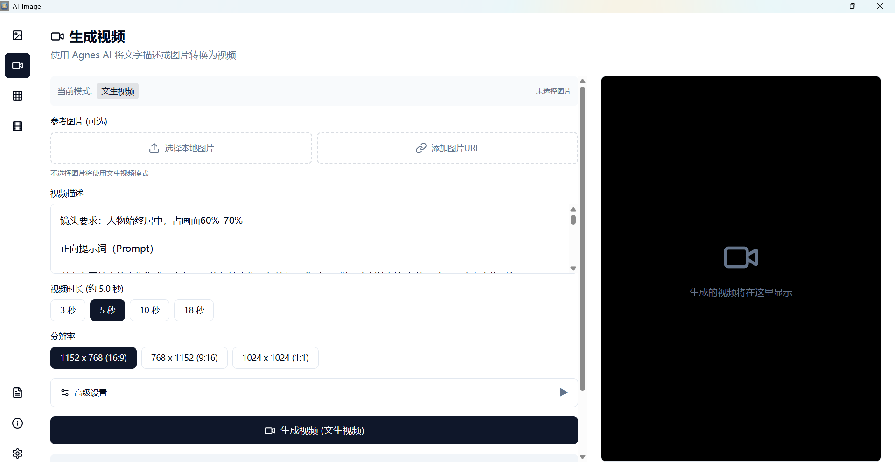
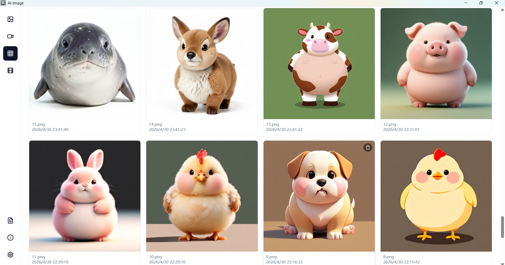
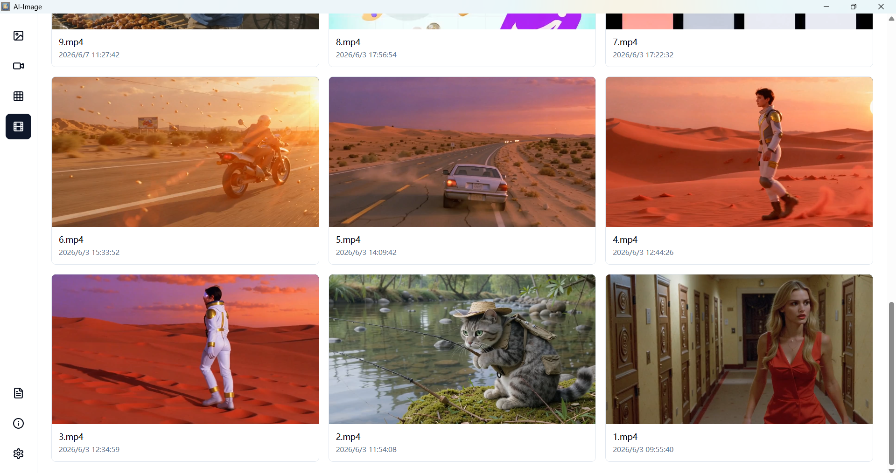
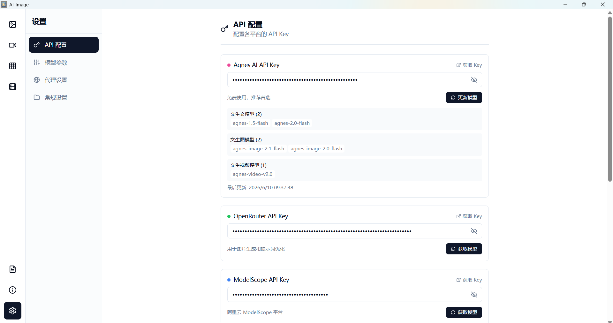

# AI Image V2

AI 图片/视频生成桌面应用。

## 功能特性

- **AI 图片生成** - 支持多种 AI 提供商（Agnes、OpenAI、Gemini、SiliconFlow 等）
- **AI 视频生成** - 支持文本/图片生成视频
- **图库管理** - 本地图片浏览、预览、批量操作
- **视频库管理** - 本地视频浏览、预览
- **批量生成** - 支持批量生成图片任务
- **自动更新** - 内置更新检查机制

<br />

## 首次使用

1. 打开设置页面配置 API Key
2. 选择 AI 提供商
3. 开始生成图片/视频

## 界面预览











### 生成示例


## 技术栈

- **前端**: Vue 3 + TypeScript + Tailwind CSS
- **后端**: Rust + Tauri v2
- **构建**: Vite

## 开发

```bash
# 安装依赖
npm install

# 开发模式
npm run tauri:dev

# 构建
npm run tauri:build
```

##

## 许可证

MIT
